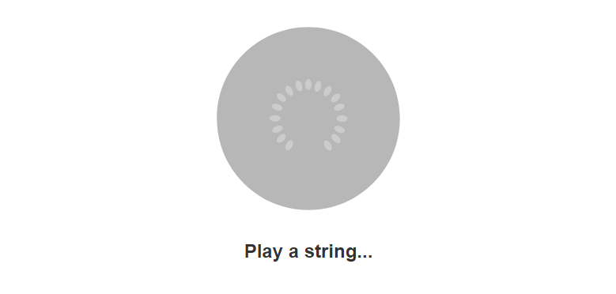

> Web Audio Changes in m36... https://developers.google.com/web/updates/2014/07/Web-Audio-Changes-in-m36, Starting from scratch yet again.  
## Google Assistant Guitar Tuner

  
v.0.1  
- Using Web Audio API
- Capture & Analyze user input
- Display to user tuning suggestions via Google Home SVG
- Tunes high e, 1st string

TODO  
- Complete standard tuning capabilities
